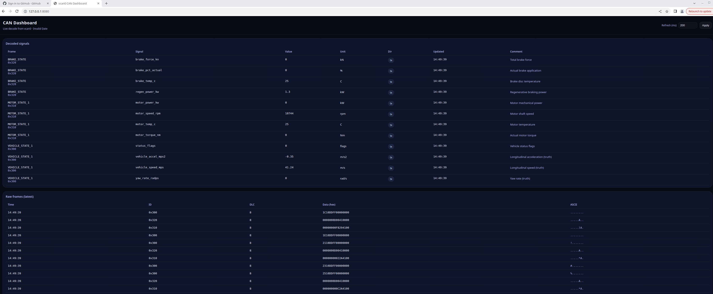

# CAN Diagnostics Web Server (vcan0)

A lightweight **Go + HTML/CSS** web dashboard that:

- Listens to **SocketCAN** frames on `vcan0` (or any `canX` interface)
- Decodes signals using a **CSV CAN map** (`can_map.csv`)
- Serves a clean web UI on **localhost** showing:
  - **Decoded signals** (with units, direction, comments, timestamps)
  - **Raw frames** (latest N frames)

This is designed to be a practical **HIL / SIL diagnostics UI** for your vehicle/plant simulation pipeline.

---

## Screenshot




---

## Repository layout

```
.
├── can-web
│   ├── can_map.csv
│   ├── go.mod
│   ├── go.sum
│   ├── main.go
│   ├── run_script.sh
│   └── web
│       ├── index.html
│       └── styles.css
└── can_web_server.png
```

---

## Prerequisites

### 1) Linux with SocketCAN
This project assumes Linux with SocketCAN enabled (native on most distros).

### 2) Go toolchain
Install Go (recommended: official tarball or your distro package), then verify:

```bash
go version
```

### 3) CAN utilities (optional, for testing)
Helpful tools:

```bash
sudo apt-get update
sudo apt-get install -y can-utils
```

---

## Quick start (vcan0)

From the repo root:

```bash
cd can-web
chmod +x run_script.sh
./run_script.sh
```

Then open:

- `http://127.0.0.1:8080`

---

## Creating the vcan0 interface (manual)

If you prefer doing it yourself:

```bash
sudo modprobe vcan
sudo ip link add dev vcan0 type vcan
sudo ip link set up vcan0
ip link show vcan0
```

---

## Sending test frames

In another terminal:

```bash
# Example: send VEHICLE_STATE_1 (0x300) with 8 bytes
cansend vcan0 300#1122334455667788
```

You can also watch raw traffic:

```bash
candump vcan0
```

---

## Configuration

The server reads configuration from environment variables (with defaults):

| Variable | Default | Meaning |
|---|---:|---|
| `CAN_IFACE` | `vcan0` | SocketCAN interface to listen on |
| `HTTP_ADDR` | `127.0.0.1:8080` | HTTP bind address |
| `CAN_MAP` | `can_map.csv` | Path to CAN map CSV |

Example:

```bash
CAN_IFACE=can0 HTTP_ADDR=0.0.0.0:8080 CAN_MAP=./can_map.csv go run .
```

---

## CAN map format

The decoder expects a CSV similar to the provided `can_map.csv`, with fields like:

- `frame_id`, `frame_name`
- `signal_name`
- `start_bit`, `bit_length`
- `endianness`, `signed`
- `factor`, `offset`, `min`, `max`, `unit`
- `direction`, `comment`

The server uses the map to extract raw bits, apply scaling, and display engineering values in the UI.

---

## Notes / Tips

- If you see **no frames**:
  - confirm `vcan0` exists and is **UP**
  - run `candump vcan0` in another terminal to verify traffic
- If the UI loads but stays empty:
  - verify the CAN IDs you’re sending exist in `can_map.csv`

---

## License

MIT (or replace with your preferred license).
